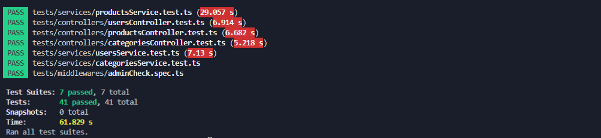

# Fullstack E-commerce Backend

This backend module is a part of Fullstack project at Integrify 2024. It encompasses collection of APIs aimed to meeth the diverse needs of E-commerce application. From user and product management to order processing, these REST APIs offer seamless functionality for a better user experience. The data are stored in MongoDB database, ensuring security and reliability. Each entity basically have a CRUD(Create, Read, Update, Delete) operations but also an authorized access for ADMIN to manage every aspect of this module. Authentication is handled using JSON Web Tokens (JWT).

This module is built with Typescript, Node, Express and MongoDB.

## Table of Contents

- [Fullstack E-commerce Backend](#fullstack-e-commerce-backend)
- [Entity Relationship Diagram](#entity-relationship-diagram)
- [Getting Started](#getting-started)
- [Project Folder Structure](#project-folder-structure)
- [Used Package Script](#package-scripts)
- [Features](#features)
- [Testing](#testing)
- [Deployment](#deployment)

## Entity Relationship Diagram


#### Entities

- **Users**
- **Products**
- **Categories**
- **Orders**
- **Order Item**

### Enum

- **Size**
- **UserRole**

## Getting started

### Prerequisites

- node `^19.2.0`
- npm `^9.2.0`

Make sure you have [npm](https://www.npmjs.com/get-npm) installed globally.

#### 1.Clone the project:

```bash
$ git clone https://github.com/roshanbist/fullstack-e-commerce-api.git
$ cd fullstack-e-commerce-api
```

#### 2.Install and run:

```bash
$ npm install    # Install project dependencies
$ npm run start  # Compile and launch on local environment
```

#### 3. Navigate to [http://localhost:{yourPortAdressForBackend}](http://localhost:8080)

## Project Folder Structure

```
└── 📁src
    └── .DS_Store
    └── app.ts
    └── 📁assets
        └── 📁images
            └── ERD-ECOMMERCE.png
    └── 📁config
        └── email.ts
        └── passport.ts
    └── 📁controllers
        └── adminController.ts
        └── categoriesController.ts
        └── ordersController.ts
        └── productsController.ts
        └── usersController.ts
    └── 📁errors
        └── ApiError.ts
    └── 📁middlewares
        └── adminCheck.ts
        └── apiErrorHandlerMiddleware.ts
    └── 📁misc
        └── 📁types
            └── Category.ts
            └── GoogleCredential.ts
            └── JwtPayload.ts
            └── Order.ts
            └── Passport.ts
            └── Password.ts
            └── Product.ts
            └── Size.ts
            └── User.ts
    └── 📁model
        └── CategoryModel.ts
        └── OrderItemModel.ts
        └── OrderModel.ts
        └── ProductModel.ts
        └── UserModel.ts
    └── 📁routers
        └── adminRouter.ts
        └── categoriesRouter.ts
        └── orderRouter.ts
        └── productsRouter.ts
        └── usersRouter.ts
    └── server.ts
    └── 📁services
        └── categoriesService.ts
        └── ordersService.ts
        └── productsService.ts
        └── usersService.ts
    └── 📁utils
        └── AuthUtil.ts
        └── commonUtil.ts
```

## Used Package Scripts

```bash
    "scripts": {
    "start": "node dist/server.js",
    "dev": "nodemon --watch src/**/*.ts --exec ts-node src/server.ts",
    "build": "tsc -p .",
    "test": "jest --runInBand --forceExit --detectOpenHandles --coverage  --verbose false"
    }
```

## Authentication

This REST API implement user authentication using JSON Web Tokens (JWT).

## Features

1.  Products

    - Get list of all products with/without pagination(limit, offset)
    - Filtered the products by: title, categories, price range
    - Get list of sorted products by title (ASC, DESC)
    - Get details of a product by its product id

2.  Categories

    - Get list of all categories
    - Get a category by category id

3.  Users

    - Sign up a new user (username, password, first name, last name, email, address)
    - Sign in user with email/password
    - Update user profile (first name, last name, email)
    - Change password (username, old password, new password)

4.  Order

    - Get list of all user's order
    - Get a user's order by order ID

5.  Admin
    - Get CRUD operation of product
    - Get CRUD operation of caetgory

## Testing

For the testing, Jest, Supertest, MongoDB memory server are used.

- [Jest](https://jestjs.io/),

- [Supertest](https://www.npmjs.com/package/supertest),

- [MongoDB memory server](https://www.npmjs.com/package/mongodb-memory-server)

Testing of the backend module includes:

- Controllers
  - productsController.test.ts
  - categoriesController.test.ts
  - usersController.test.ts
- Middlewares
  - adminCheck.spec.ts
- Services

  - productsService.test.ts
  - categoreisService.test.ts
  - usersService.test.ts



Check test code in tests folder

```bash
$ npm run test
```

## Deployment

The API is live now hosted by RENDER.
Check the live link here [https://fs17-backend-b5i2.onrender.com](https://fs17-backend-b5i2.onrender.com)
